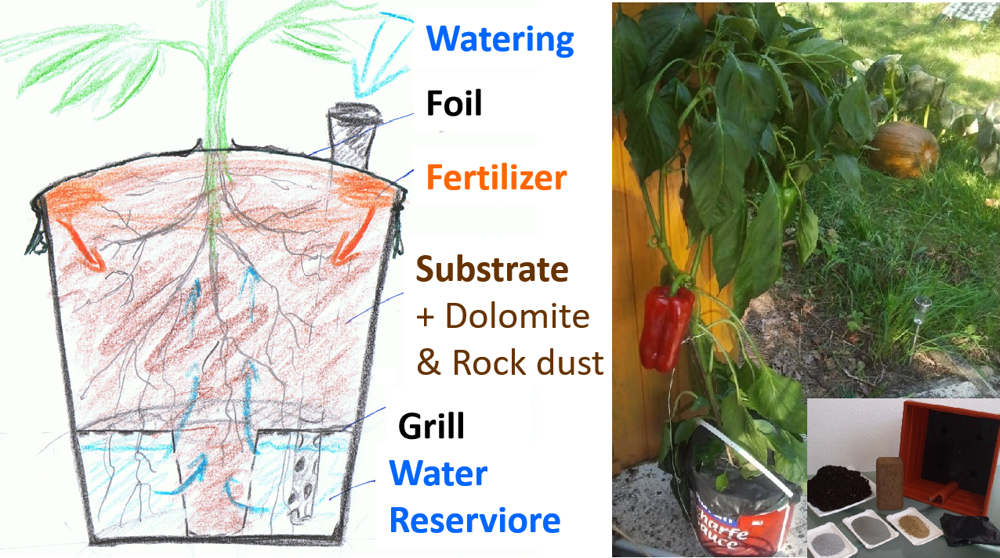

# 🔬 How Growtainer Works: The Core Principle

> **"Water and air from below. Nutrients from above. Self-regulating over the entire growth cycle."**

Growtainer is not just a self-watering planter — it’s a **biologically intelligent micro-farming system** that mimics natural soil processes to grow healthier, more nutrient-dense food with minimal effort.

Unlike conventional planters, Growtainer integrates **physics, soil science, and plant autonomy** into one simple design.

---

## 🧱 Core Components

### 1. **Water Reservoir (Bottom Layer)**
- Holds water for up to 1–2 weeks during low growth / sun or wind exposure
- Substrate draws moisture **via capillary action** up into the planter
- No over- or under-watering — the plant decides how much to "drink"

### 2. **Substrate Grid (Rost)**
- A breathable screen separating water from soil
- Prevents root rot by ensuring **constant aeration**
- Allows roots to grow down for water while staying oxygenated
- Allows for excess water to drip back into the reserviour 

### 3. **Active Substrate (Growing Medium)**
- Enriched with:
  - **Volcanic rock dust** (Urgesteinsmehl) → trace minerals (Zn, Se, Mn, Fe)
  - **Worm castings** (Wurmhumus) → microbes, plant hormones
  - **Coconut coir / fiber** → capilary effect, water retention & lightweight structure, allowing airation, rot & mold resistant
  - **Garden Compost** → basic nutrition and beneficial bacteria
  - **Layer of Dolomite rock powder** → serves as high Magnesium chalc reserviour (slow release sweetener) without spoiling the pH of the whole substrate (nutrient lockout)
- Designed for **long-term biology**, not just short-term growth

### 4. **Surface Cover (Agriculture foil)**
- Reduces evaporation to a minimum
- Blocks weeds and regulates temperature
- Enables **slow-release fertilization** from the solid fertilizer deposit ring on top of substrate
- Traps smell from organic fertilizers like Guano

### 5. **Nutrient Reservoir (Water + Minerals)**
- Nutrients are dissolved in the water below
- Plant **self-doses** as it uptakes water
- No manual fertilizing needed — if growth slows, just refill the reservoir

---

## 🔄 Self-Regulation: The Plant Is in Control

The magic of Growtainer lies in **plant autonomy**:
- The plant pulls water only when needed → avoids stress
- With water, it absorbs nutrients proportionally → no over-fertilization
- Healthy roots = healthy plant = higher nutrient density in food

This is **not automation** — it’s **collaboration with nature**.

---

## 🌿 Why This Matters

| Conventional Planter | Growtainer |
|----------------------|----------|
| Daily watering needed | Refill every 1–2 weeks |
| Fertilizer applied manually | Self-dosing via water uptake |
| Soil biology often ignored | Active, mineral-rich, living soil |
| Risk of overwatering/overfeeding | Self-regulating, low risk |
| Focus on yield | Focus on **yield + nutrition + ease** |

---

## 📎 Learn More
- [DIY Guide](diy-guide.md) → How to build your own
- [Substrate Guide](substrate.md) → Soil mix & sourcing
- [Science Behind It](science.md) → Capillary action, nutrient uptake studies

🌱 Growtainer: Where smart design meets deep nourishment.
